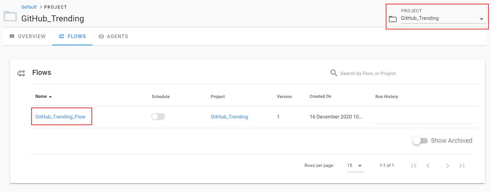
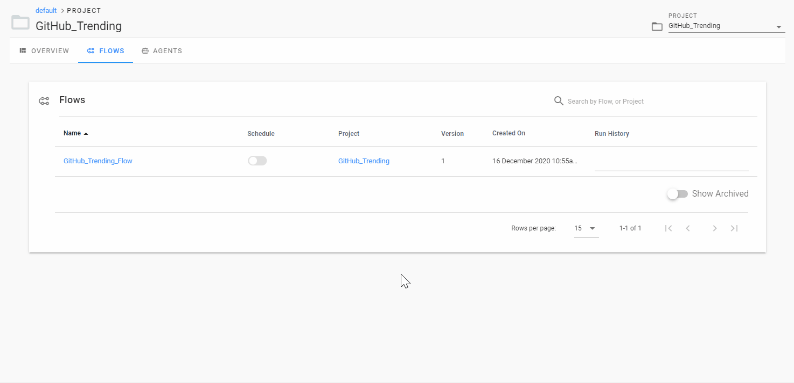
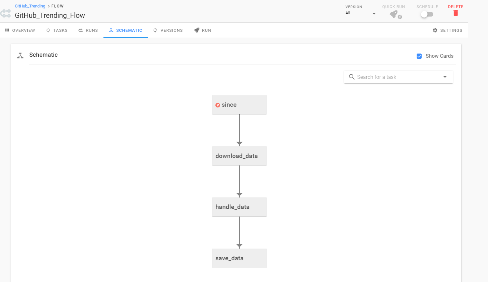

在处理复杂工作时，将所有的逻辑都写到一个任务中是一种很糟糕的做法。将其拆解成多个子任务，重新编排并监控运行状况则要靠谱的多。

Prefect 是一款基于 Python 的工作流工具。

- [快速开始](#快速开始)
  - [安装](#安装)
  - [官方示例](#官方示例)
- [项目实践](#项目实践)
  - [功能实现](#功能实现)
- [工作流编排](#工作流编排)
- [官方工程模板](#官方工程模板)

## 快速开始

### 安装

```shell
pip install prefect
```

### 官方示例

```python
from prefect import task, Flow, Parameter


@task(log_stdout=True)
def say_hello(name):
    print("Hello, {}!".format(name))


with Flow("My First Flow") as flow:
    name = Parameter('name')
    say_hello(name)


flow.run(name='world') # "Hello, world!"
flow.run(name='Marvin') # "Hello, Marvin!"
```

可以看到，Prefect 很好地执行了任务，并输出了运行的日志。接下来，我们来尝试用 Prefect 编写一个简易的工作流程序。

## 项目实践

现在有这么个需求：获取 GitHub Trending 每日数据，并保存成 CSV 文件。这个要怎么实现呢？

我们先拆解下需求，大致可以分为以下步骤：

- download_data：调用接口，获取 GitHub Trending 每日数据。
- handle_data：对数据进行处理，选取需要的字段。
- save_data：将处理好的数据保存成 CSV 文件。

以上的每个步骤分别对应一个子任务，我们来实现下。

### 功能实现

```python
from prefect import task, Flow, Parameter
import requests
import csv

GITHUB_TRENDING_URL = "https://trendings.herokuapp.com/repo"

@task
def download_data(since):
    params = {'since': since}
    trending_data = requests.get(GITHUB_TRENDING_URL, params).json()
    return trending_data

@task
def handle_data(data):
    return [i for i in data["items"]]

@task
def save_data(rows):
    headers = ["repo", "repo_link", "stars", "forks", "added_stars"]
    with open("/tmp/trending.csv", "w", newline="") as f:
        f_csv = csv.DictWriter(f, headers, extrasaction='ignore')
        f_csv.writeheader()
        f_csv.writerows(rows)

with Flow("GitHub_Trending_Flow") as flow:
    since = Parameter("since")
    data = download_data(since)
    rows = handle_data(data)
    save_data(rows)

#flow.run(since="weekly")
flow.register(project_name="GitHub_Trending")
```

## 工作流编排

Prefect 提供了开源的 server 以及 UI 来编排工作流。但在使用前，请确保安装了 docker 和 docker-compose。

如果是第一次启动需要运行以下命令配置本地工作流：

```shell
prefect backend server
```

运行后会在 ~/.prefect 目录下生成配置文件，之后运行以下命令启动 server：

```shell
prefect server start
```

启动 server 后，访问 http://localhost:8080，如果 server 不安装在本机，则需要修改 ip 地址。同时也要注意修改主页 「PREFECT SERVER」中 GraphQL 的地址。

执行工作流任务至少需要运行一个 agent，可以在本机开启，命令如下：

```shell
prefect agent local start
```

接下来需要创建项目，可以通过命令行创建项目：

```shell
prefect create project "GitHub_Trending"
```

项目创建后，加入以下代码可以将工作流注册到 server 中，这里的 project_name 要和刚创建的项目名对应：

运行代码进行注册，选好项目可以看到注册成功的工作流。



接着试下从页面运行工作流，不过别忘了指定参数的值：



运行过程中，我们可以看到每个任务执行所消耗的时间。而在 「SCHEMATIC」中，我们也可以很清晰地了解整个工作流任务的依赖关系。



## 官方工程模板

https://github.com/PrefectHQ/prefect-collection-template.git

可以快速创建工程：

```shell
cookiecutter -v https://github.com/PrefectHQ/prefect-collection-template.git
```
