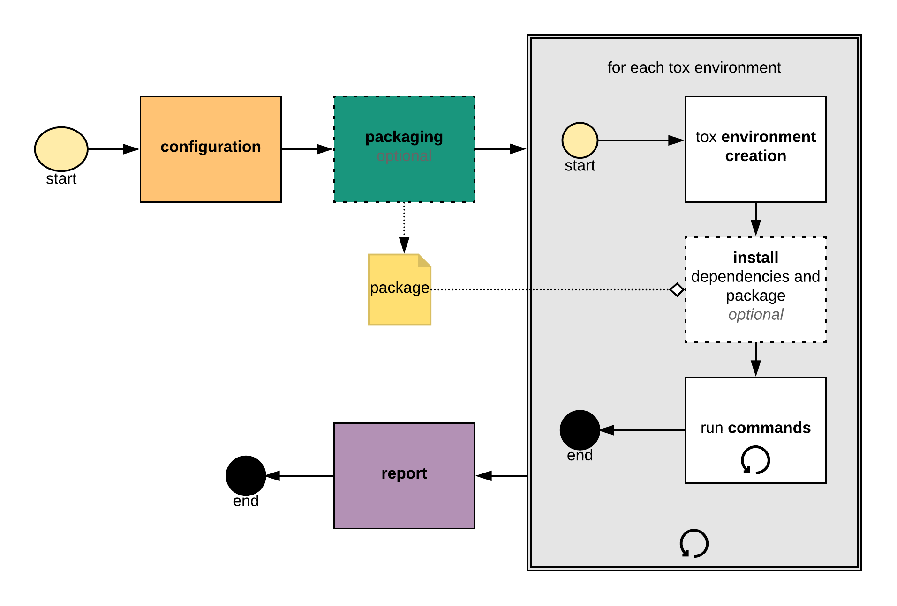

> 经常在知名的 Python 开源项目里见到 tox.ini 文件，于是就搜了一下。

命令行驱动的持续集成前端和开发任务自动化工具。

https://github.com/tox-dev/tox

其核心作用是支持创建隔离的 Python 环境，在里面可以安装不同版本的 Python 解释器与各种依赖库，以此方便开发者做自动化测试、打包、持续集成等事情。

简单来说，tox 是一个**管理测试虚拟环境的命令行工具**。 它已存在多年且广被开发者们使用，例如，著名的云计算平台 OpenStack 也采用了它，作为最基础的测试工具之一。

## 用法

在项目目录下运行：

```shell
tox
```

## 个人评价

不方便，必须手动装各种版本的 Python，远不如 Github Action。

## tox 能做什么

- 创建开发环境
- 运行静态代码分析与测试工具
- 自动化构建包
- 针对 tox 构建的软件包运行测试
- 检查软件包是否能在不同的 Python 版本/解释器中顺利安装
- 统一持续集成（CI）和基于命令行的测试
- 创建和部署项目文档
- 将软件包发布到 PyPI 或任何其它平台

官方功能示例：

https://tox.wiki/en/latest/examples.html

## tox 怎么配置

```shell
pip install tox
```

tox 的行为由其配置文件控制，当前它支持 3 种配置文件：

- pyproject.toml
- tox.ini
- setup.cfg

以 tox 项目自己的 tox.ini 配置内容为例，见同目录 tox.ini。

每个 `[xxx]` 及其下方内容组成一个章节（section），每个章节间使用空行作间隔。

`[tox]` 下面是全局性的配置项，envlist 字段定义了 tox 去操作的环境。`[xxx]` 下面是 xxx 虚拟环境的配置项，`[xxx:yyy]` 继承 xxx 的配置，同时其自身配置项的优先级更高。

对于每个虚拟环境，可用的配置项很多，例如常用的有：description（描述信息）、basepython（Python解释器版本）、deps（环境依赖项）、commands（命令语句）等等。

tox 还支持作变量替换，它提供了一些内置的基础变量（全局的或对于虚拟环境的）：{toxinidir}、{homedir}、{envname}、{envdir}等等。

除了基础性的变量替换，它还支持这些高级用法：

- 取操作系统的环境变量：`{env:KEY}`，效果等同于 `os.environ['KEY']` 。可以变化成：`{env:KEY:DEFAULTVALUE}`，在取不到环境变量时则使用默认值；`{env:KEY:{env:DEFAULT_OF_KEY}}`，达到 if-else 的取值效果
- 传递命令行参数：`{posargs:DEFAULTS}`，当没有命令行参数时，使用 DEFAULTS 值。使用方式：`tox arg1 arg2` 传两个参，或者`tox -- --opt1 arg1` 将 “-- opt1 arg1” 作为整体传入。
- 章节间传值：`{[sectionname]valuename}`，不同章节的内容可以传递使用。
- 交互式控制台注入：`{tty:ON_VALUE:OFF_VALUE}`，当交互式 shell 控制台开启时，使用第一个值，否则使用第二个。pytest 在使用“--pdb”时，是这样的例子。
- 花括号“{}”除了可以做变量替换使用，它还可以作为“或关系”判断的取值。直接看下面的例子：

```ini
[tox]
envlist = {py27,py36}-django{15,16}
```

`{py27,py36}-django{15,16}` 的 2 组花括号内各有 2 个值，它们实际可以组合成 4 个环境：py27-django15、py27-django16、py36-django15、py36-django16。

## tox 的插件化

除了自身强大的可配置性，tox 还具有很强的可扩展性，它是可插拔的（pluggable），围绕它产生了一个极为丰富的插件生态。

使用pip search tox ，可以看到数量众多的“tox-”开头的库，它们都是 tox 的插件包。其中不乏 setuptools、pipenv、conda、travis、pytest、docker 等被大家熟知的名字。

## tox 的工作流程

接下来看看 tox 是怎么运作的：



其工作流程中主要的环节有：

- 配置（从figuration）：加载配置文件（如 tox.ini），解析命令行参数，读取系统环境变量等
- 打包（packaging）：可选的，对于带有 setup.py 文件的项目，可以在这步去生成它的源发行版
- 创建虚拟环境：默认使用 virtualenv 来创建虚拟环境，并根据配置项中的“deps”安装所需的依赖项，然后执行配置好的命令（commands）
- 报告（report）：汇总所有虚拟环境的运行结果并罗列出来
